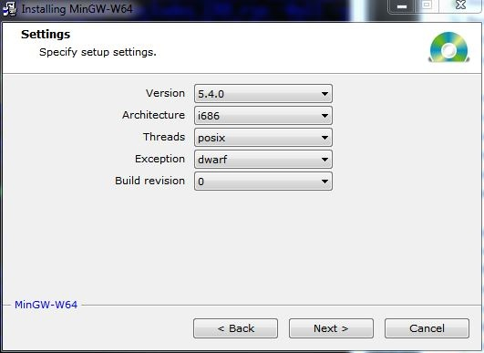

<!--
* KINOVA (R) KORTEX (TM)
*
* Copyright (c) 2018 Kinova inc. All rights reserved.
*
* This software may be modified and distributed under the
* terms of the BSD 3-Clause license.
*
* Refer to the LICENSE file for details.
*
-->

<!-- TOC -->

- [Setup example cpp environment](#setup-example-cpp-environment)
    - [Setup PC environment](#setup-pc-environment)
        - [CMake](#cmake)
        - [GCC 5.4 Compiler (Prefered)](#gcc-54-compiler-prefered)
            - [Procedure to install GCC 5.4 under Linux (Ubuntu >16.04)](#procedure-to-install-gcc-54-under-linux-ubuntu-1604)
            - [Procedure to install GCC 5.4 under Windows](#procedure-to-install-gcc-54-under-windows)
    - [Install Cpp Kortex Api & the needed dependencies](#install-cpp-kortex-api--the-needed-dependencies)
- [Build Instruction](#build-instruction)
- [How To Use Examples With Gen3 Robot](#how-to-use-examples-with-gen3-robot)
- [Api Documentation](#api-documentation)
- [Reference](#reference)
            - [Usefull Links](#usefull-links)
- [Back to root topic: **readme.md**](#back-to-root-topic-readmemd)

<!-- /TOC -->

<a id="markdown-setup-example-cpp-environment" name="setup-example-cpp-environment"></a>
# Setup example cpp environment

<!--
<a id="markdown-docker-environment" name="docker-environment"></a>
## DOCKER environment
> 
> Consider to use docker as a starting point
<a id="markdown-refer-to-the-main-readme-for-docker-instalation-details-parent-readme" name="refer-to-the-main-readme-for-docker-instalation-details-parent-readme"></a>
#### Refer to the main readme for docker instalation details: **[parent readme]**

<p></p>
-->

<a id="markdown-setup-pc-environment" name="setup-pc-environment"></a>
## Setup PC environment
> 
<a id="markdown-cmake" name="cmake"></a>
### CMake
> The cpp examples projects in this repository are using cmake.  
> Here in the following link you will find the instruction to install cmake.  
> - cmake >= 3.10: [CMake Install Page](https://cmake.org/install)
<a id="markdown-gcc-54-compiler-prefered" name="gcc-54-compiler-prefered"></a>
### GCC 5.4 Compiler (Prefered)  
> 
> To check installed version of gcc on Windows or Linux  
> *(Note: This procedure only work on windows if your add MinGW bin directory to your path)*  
> ```sh
> gcc --version
> ```
<a id="markdown-procedure-to-install-gcc-54-under-linux-ubuntu-1604" name="procedure-to-install-gcc-54-under-linux-ubuntu-1604"></a>
#### Procedure to install GCC 5.4 under Linux (Ubuntu >16.04)
> ```sh
> sudo apt-get install build-essential
> ```
<a id="markdown-procedure-to-install-gcc-54-under-windows" name="procedure-to-install-gcc-54-under-windows"></a>
#### Procedure to install GCC 5.4 under Windows
> Before we start, GCC is not naturally code for Windows we need to use a GCC port for windows call MinGW-w64. Don't be afraid by the w64 at the end of the name, this only means we can install 64bits package. The 32 bits version are still available and it's one of them we going to use to compile the affected project
> 
> 1. Go to  https://sourceforge.net/projects/mingw-w64
> 2. Start the installer and press next until you reach the installation option page
> 3. On the Installation opiton page make sure your option look exactly like this. ( all option are by default except for version which is the version of GCC we want to install 5.4 in our case)
> 
> 
> 
> 4. Click next until the end of the installation.The install directory by default is the one set in the build script include with our project
> 5. (optional) : You can add the path of the bin directory to the system path to make all the MinGW commands and tool available system wide
> 

<!-- omit in toc 
<a id="markdown-windows-msvc-2017-compiler-for-" name="windows-msvc-2017-compiler-for-"></a>
### Windows MSVC 2017 Compiler (for )  
> 
> + Install “Build tools for Visual Studio 2017” from here: [Microsoft VS 2017 Download](https://visualstudio.microsoft.com/downloads/?rr=https%3A%2F%2Fwww.google.ca%2F)
> + Launch the “x64 Native Tools Command Prompt for Visual Studio 2017”.  It should be found here under the default installation folder:  
> <code>“C:\ProgramData\Microsoft\Windows\Start Menu\Programs\Visual Studio 2017\Visual Studio Tools\VC”</code>
> 
-->

<a id="markdown-install-cpp-kortex-api--the-needed-dependencies" name="install-cpp-kortex-api--the-needed-dependencies"></a>
## Install Cpp Kortex Api & the needed dependencies

<!-- 
> *Installation using jfrog cli:*
> 
> from *kortex_api* sub-directory
> ```sh
> jfrog rt ...
> ```
-->
> *Manual installation using downloaded archive:*  
> + Download the archive via the Kinova goggle drive: [kortex_api](https://drive.google.com/file/d/19zfCNlRUfNBbZoMW9LOpLjVrYOO2BwYb/view)  
> + Uncompress the content of the archive and emplace that in sub-directory *kortex_api*  

*Be sure to respect one of the following directory hierarchies.*  
*1. using one specific kortex api os/compiler*
```sh
examples/kortex_api  
┬  
├ include/
├ lib/  
    ┬  
    ├ debug/  
    └ release/
└ 
```
*2. using KORTEX_SUB_DIR cmake argument to specify the kortex api os/compiler*
```sh
examples/kortex_api  
┬  
├ os_arch/
    ┬  
    ├ include/
    ├ lib/  
        ┬  
        ├ debug/  
        └ release/
└ 
```

<a id="markdown-build-instruction" name="build-instruction"></a>
# Build Instruction

> <p><details open>
> <summary>Linux Ubuntu</summary>
> 
> ```sh
> mkdir build  
> cd build  
> cmake .. -DCMAKE_BUILD_TYPE=release [-DKORTEX_SUB_DIR=<os_arch dir name>]  
> make  
> ```
>
> </details></p>  

> <p><details open>
> <p></p>
> <i>(note that the name of the executable is mingw32-make.exe even for the 64 bit version)</i>  
> <summary>Windows using gcc compiler</summary>
> 
> ```sh
> mkdir build  
> cd build  
> cmake .. -G "MinGW Makefiles" -DCMAKE_BUILD_TYPE=release [-DKORTEX_SUB_DIR=<os_arch dir name>]  
> mingw32-make  
> ```
>
> </details></p>  

><p><details open>
><summary>Windows - Create Visual Studio 2017 solution</summary>
>
> ```sh
> mkdir build  
> cd build  
> cmake .. -G "Visual Studio 15 2017 [arch]" -DCMAKE_SH=CMAKE_SH-NOTFOUND -DCMAKE_BUILD_TYPE=release [-DKORTEX_SUB_DIR=<os_arch dir name>]  
> ```
>
> </details></p>  

><p><details open>
><summary>Windows - command-line msvc build</summary>
>
> ```sh
> call "C:\Program Files (x86)\Microsoft Visual > Studio\2017\BuildTools\VC\Auxiliary\Build\vcvarsamd64_x86.bat"
>  
> :: Add the cl.exe path the Windows Environment PATH
> set PATH=%PATH%;C:/Program Files (x86)/Microsoft Visual Studio/2017/BuildTools/VC/Tools/MSVC/14.15.26726/bin/Hostx64/x64
> 
> mkdir build  
> cd build  
> cmake .. -G "NMake Makefiles" -DCMAKE_SH=CMAKE_SH-NOTFOUND -DCMAKE_BUILD_TYPE=Release  
> nmake
>```
>
> </details></p>  

<a id="markdown-how-to-use-examples-with-gen3-robot" name="how-to-use-examples-with-gen3-robot"></a>
# How To Use Examples With Gen3 Robot

Once compiled, C++ example are independant and can be run independently. You only have to double clic on the
executable and see the example running.

*(note that examples need the robot to be cable-connected and that they are using the factory default ip address)*

<a id="markdown-api-documentation" name="api-documentation"></a>
# Api Documentation
Here a link on the generated documentation  
[Api C++ Services Documentation](../doc/markdown/index.md)  

<a id="markdown-reference" name="reference"></a>
# Reference
<a id="markdown-usefull-links" name="usefull-links"></a>
#### Usefull Links
|  |  |  
| ---: | --- |  
| Google Protobuf Generated Cpp: | https://developers.google.com/protocol-buffers/docs/reference/cpp-generated |  

__________________________
<a id="markdown-back-to-root-topic-readmemdreadmemd" name="back-to-root-topic-readmemdreadmemd"></a>
# Back to root topic: **[readme.md](../../readme.md)**  

